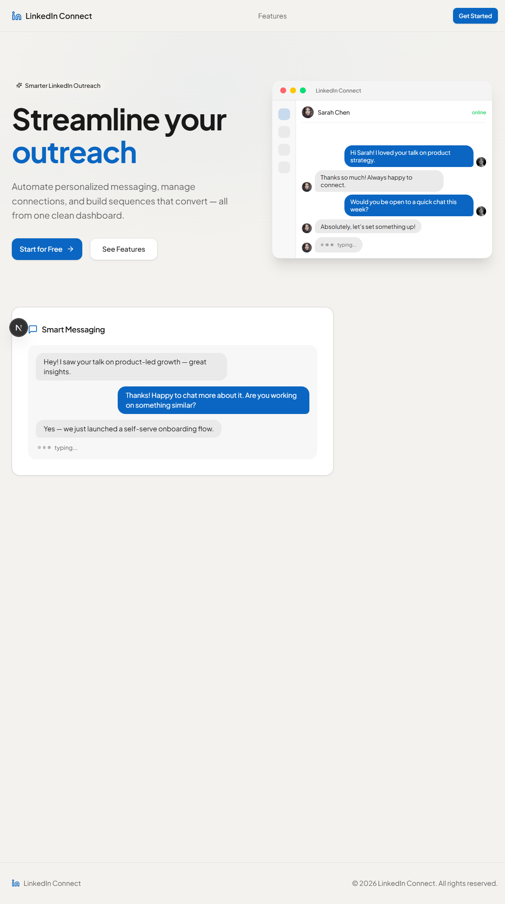

# LinkFlow

LinkedIn outreach automation platform. Manage connections, send personalized messages, and run multi-step outreach sequences from a single dashboard.



## Features

- **LinkedIn Messaging** — View chats, send messages, and manage conversations via Unipile
- **Connection Search** — Search LinkedIn profiles and send connection invites
- **Outreach Sequences** — Build multi-step campaigns (invite → wait → follow-up) with scheduling and rate limits
- **Message Templates** — Create reusable templates for invites and follow-ups
- **CSV Import** — Bulk import target profiles from CSV files

## Tech Stack

- **Framework:** Next.js 16 (App Router)
- **Runtime:** Bun
- **Database:** SQLite via Prisma ORM
- **UI:** Tailwind CSS 4, Radix UI, shadcn/ui
- **LinkedIn API:** Unipile SDK
- **Auth:** Email/password with bcrypt

## Getting Started

### Prerequisites

- [Bun](https://bun.sh) (v1+)
- A [Unipile](https://unipile.com) account with a linked LinkedIn connection

### Setup

```bash
# Clone the repo
git clone git@github.com:Msparihar/linkflow.git
cd linkflow

# Install dependencies
bun install

# Set up environment variables
cp .env.example .env
# Edit .env with your credentials

# Initialize the database
bunx prisma migrate dev

# Start the dev server
bun run dev
```

The app will be available at `http://localhost:3000`.

### Environment Variables

See [`.env.example`](.env.example) for all required variables:

| Variable | Description |
|---|---|
| `DATABASE_URL` | Prisma database connection string |
| `LINKEDIN_CLIENT_ID` | LinkedIn OAuth app client ID |
| `LINKEDIN_CLIENT_SECRET` | LinkedIn OAuth app client secret |
| `LINKEDIN_REDIRECT_URI` | OAuth callback URL |
| `UNIPILE_API_URL` | Unipile API base URL |
| `UNIPILE_ACCESS_TOKEN` | Unipile API access token |
| `NEXT_PUBLIC_APP_URL` | Public-facing app URL |

### Docker

```bash
docker build -t linkflow .
docker run -p 3000:3000 --env-file .env linkflow
```

## Project Structure

```
app/
├── api/
│   ├── auth/          # Login, register, OAuth callbacks
│   ├── linkedin/      # Chats, connections, search, invite, message
│   ├── sequences/     # Outreach sequence CRUD and execution
│   ├── templates/     # Message template CRUD
│   └── import/        # CSV import
├── dashboard/         # Main app shell
├── login/             # Login page
└── page.tsx           # Landing page
components/            # UI components (sidebar, panels, landing page)
prisma/                # Schema and migrations
hooks/                 # Custom React hooks
```

## License

Private
